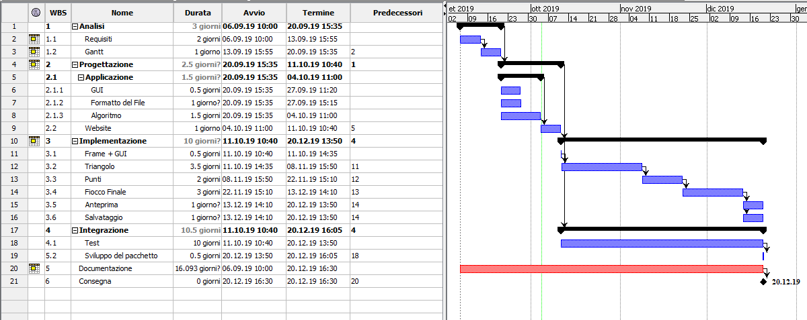
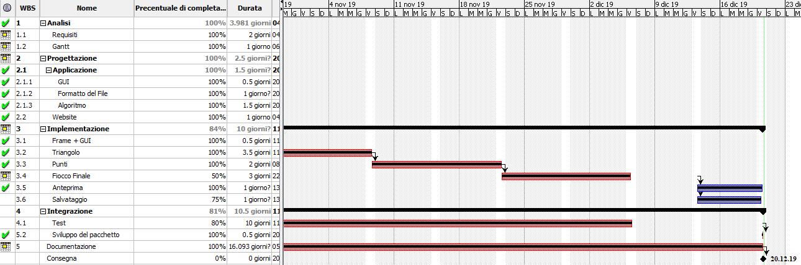

# Documentazione del Progetto
## Bruno Gomes

1. [Introduzione](#introduzione)

  - [Informazioni sul progetto](#informazioni-sul-progetto)

  - [Abstract](#abstract)

  - [Scopo](#scopo)

2. [Analisi](#analisi)

  - [Analisi del dominio](#analisi-del-dominio)
  
  - [Analisi dei mezzi](#analisi-dei-mezzi)

  - [Analisi e specifica dei requisiti](#analisi-e-specifica-dei-requisiti)

  - [Use case](#use-case)

  - [Pianificazione](#pianificazione)

3. [Progettazione](#progettazione)

  - [Design dell’architettura del sistema](#design-dell’architettura-del-sistema)

  - [Design dei dati e database](#design-dei-dati-e-database)

4. [Implementazione](#implementazione)

5. [Test](#test)

  - [Protocollo di test](#protocollo-di-test)

  - [Risultati test](#risultati-test)

  - [Mancanze/limitazioni conosciute](#mancanze/limitazioni-conosciute)

6. [Consuntivo](#consuntivo)

7. [Conclusioni](#conclusioni)

  - [Sviluppi futuri](#sviluppi-futuri)

  - [Considerazioni personali](#considerazioni-personali)

8. [Sitografia](#sitografia)

9. [Allegati](#allegati)

## Introduzione

### Informazioni sul progetto

  Progetto per il Modulo 306 del 3° anno di Scuola, nella sezione di Informatica. I nostri 2 docenti per questo modulo, Luca Muggiasca e Geo Petrini, ci hanno chiesto di creare un programma dove si possa creare dei Fiocchi di Neve. Per fare questo si deve scegliere il pattern di un triangolo creando dei poligoni che cancellano parte del triangolo. Il progetto è iniziato il 6/9/2019 e finisce il 20/12/2019.

### Abstract

In questo progetto il scopo principale è quello di creare un fiocco di neve. Per realizzare questo si deve tagliare un triangolo utilizando dei poligoni con dei vertici creati dai click del utente.

Dovrò creare 2 sezioni importanti:

  - Il sito con una descrizione del progetto e un tasto di download del programma.

  - Il programma funzionante, con una GUI chiara.

Il progetto viene richiesto in uguale forma a tutti i allievi, dove ognuno decide la forma migliore in cui risolvere/eseguire il progetto.

E’ una breve e accurata rappresentazione dei contenuti di un documento,
  senza notazioni critiche o valutazioni. Lo scopo di un abstract efficace
  dovrebbe essere quello di far conoscere all’utente il contenuto di base
  di un documento e metterlo nella condizione di decidere se risponde ai
  suoi interessi e se è opportuno il ricorso al documento originale.

  Può contenere alcuni o tutti gli elementi seguenti:

  -   **Background/Situazione iniziale**

  -   **Descrizione del problema e motivazione**: Che problema ho cercato
      di risolvere? Questa sezione dovrebbe includere l'importanza del
      vostro lavoro, la difficoltà dell'area e l'effetto che potrebbe
      avere se portato a termine con successo.

  -   **Approccio/Metodi**: Come ho ottenuto dei progressi? Come ho
      risolto il problema (tecniche…)? Quale è stata l’entità del mio
      lavoro? Che fattori importanti controllo, ignoro o misuro?

  -   **Risultati**: Quale è la risposta? Quali sono i risultati? Quanto è
      più veloce, più sicuro, più economico o in qualche altro aspetto
      migliore di altri prodotti/soluzioni?

  Esempio di abstract:

  > *As the size and complexity of today’s most modern computer chips
  > increase, new techniques must be developed to effectively design and
  > create Very Large Scale Integration chips quickly. For this project, a
  > new type of hardware compiler is created. This hardware compiler will
  > read a C++ program, and physically design a suitable microprocessor
  > intended for running that specific program. With this new and powerful
  > compiler, it is possible to design anything from a small adder, to a
  > microprocessor with millions of transistors. Designing new computer
  > chips, such as the Pentium 4, can require dozens of engineers and
  > months of time. With the help of this compiler, a single person could
  > design such a large-scale microprocessor in just weeks.*

### Scopo

  Lo scopo del progetto (scopi didattici/scopi operativi). Dovrebbe
  descrivere il mandato, ma non vanno ricopiate le informazioni del
  quaderno dei compiti (che va invece allegato).

## Analisi

### Analisi del dominio

  Questo capitolo dovrebbe descrivere il contesto in cui il prodotto verrà
  utilizzato, da questa analisi dovrebbero scaturire le risposte a quesiti
  quali ad esempio:

  -   Background/Situazione iniziale

  -   Quale è e come è organizzato il contesto in cui il prodotto dovrà
      funzionare?

  -   Come viene risolto attualmente il problema? Esiste già un prodotto
      simile?

  -   Chi sono gli utenti? Che bisogni hanno? Come e dove lavorano?

  -   Che competenze/conoscenze/cultura posseggono gli utenti in relazione
      con il problema?

  -   Esistono convenzioni/standard applicati nel dominio?

  -   Che conoscenze teoriche bisogna avere/acquisire per poter operare
      efficacemente nel dominio?

  -   …

### Analisi e specifica dei requisiti

  Per eseguire il progetto, I nostri maestri ci hanno datto delle specifiche che dobbiamo raggiungere.
  Queste specifiche, obbligatorie o meno, sono delle caratteristiche che il progetto deve raggrupare.
  
##### Questo lavoro sarà svolto utilizzando il Linguaggio JAVA, e quindi il progetto ha come requisiti minimi:
  
  - La creazione di un sito con una propria descrizione del software svolto.
  - Deve essere possibile scaricare il software.
  - I tagli del triangolo devono poter essere fatti con il mouse.
  - Deve esserci un'interfaccia grafica.
  - L'area di lavoro deve essere un triangolo.
  - Deve essere possibile resettare i punti registrati.
  - Deve esistere il tasto genera fiocco.
  - Il lavoro deve poter essere salvato.
  - Il salvataggio deve essere fatto in formato PNG o SVG.
  - Il salvataggio deve avere dimensioni definite dall'utente.
  - Deve essere possibile salvare i punti di taglio.
  
##### Come Bonus ci è stato anche proposto di fare:
  - La generazione deve avvenire in tempo reale.
  - I punti devono poter essere spostati o rimossi.
  
  
####------------
  -   Quali sono i bisogni del committente?

  -   Quali funzioni deve svolgere il prodotto?

  -   Come devono essere implementate?

  -   L’utente, come vorrebbe/dovrebbe interagire con il prodotto?

  -   Come verrà utilizzato il prodotto?

  -   Che tipo di interfaccia si immagina?

  -   Che prestazioni minime deve fornire il prodotto?

  -   Che grado di sicurezza deve avere il prodotto?

  -   …

  In base alla lista dei requisiti e all’analisi degli stessi, il
  progettista redige una *specifica dei requisiti* in cui elenca e
  descrive in modo dettagliato quali sono le funzionalità che il prodotto
  fornirà. La specifica dovrebbe essere abbastanza dettagliata da poter
  essere utilizzata come base per lo sviluppo, ma non troppo; ad esempio
  non dovrebbe contenere dettagli di implementazione, o definizioni
  dettagliate dell’interfaccia grafica a meno che questi non siano
  considerati cruciali. Non si deve scordare che i requisiti non
  rappresentano delle attività bensì delle caratteristiche che il prodotto
  dovrà possedere.

**Spiegazione elementi tabella dei requisiti:**

**ID**: identificativo univoco del requisito

**Nome**: breve descrizione del requisito

**Priorità**: indica l’importanza di un requisito nell’insieme del
progetto, definita assieme al committente. Ad esempio poter disporre di
report con colonne di colori diversi ha priorità minore rispetto al
fatto di avere un database con gli elementi al suo interno. Solitamente
si definiscono al massimo di 2-3 livelli di priorità.

**Versione**: indica la versione del requisito. Ogni modifica del
requisito avrà una versione aggiornata.

Sulla documentazione apparirà solamente l’ultima versione, mentre le
vecchie dovranno essere inserite nei diari.

**Note**: eventuali osservazioni importanti o riferimenti ad altri
requisiti.

**Sotto requisiti**: elementi che compongono il requisito.

### Use case

I casi d’uso rappresentano l’interazione tra i vari attori e le
funzionalità del prodotto.

### Pianificazione

### Analisi dei mezzi

#### Software
---

Il software nel PC:

- Sublime Text 3
- ProjectLibre
- GitHub Desktop
- Apache NetBeans IDE 11.1

---

#### Hardware
---

- Asus, Intel Core I3-7020U, RAM 4GB, Intel HD Graphics 620, Windows 10 64 bit

---

## Progettazione

/*Questo capitolo descrive esaustivamente come deve essere realizzato il prodotto fin nei suoi dettagli. Una buona progettazione permette all’esecutore di evitare fraintendimenti e imprecisioni nell’implementazione del prodotto.*/

### Design dell’architettura del sistema

Descrive:

-   La struttura del programma/sistema lo schema di rete...

-   Gli oggetti/moduli/componenti che lo compongono.

-   I flussi di informazione in ingresso ed in uscita e le
    relative elaborazioni. Può utilizzare *diagrammi di flusso dei
    dati* (DFD).

-   Eventuale sitemap

### Design dei dati e database

Descrizione delle strutture di dati utilizzate dal programma in base
agli attributi e le relazioni degli oggetti in uso.

### Schema E-R, schema logico e descrizione.

Se il diagramma E-R viene modificato, sulla doc dovrà apparire l’ultima
versione, mentre le vecchie saranno sui diari.

### Design delle interfacce

Descrizione delle interfacce interne ed esterne del sistema e
dell’interfaccia utente. La progettazione delle interfacce è basata
sulle informazioni ricavate durante la fase di analisi e realizzata
tramite mockups.

### Design procedurale

Descrive i concetti dettagliati dell’architettura/sviluppo utilizzando
ad esempio:

-   Diagrammi di flusso e Nassi.

-   Tabelle.

-   Classi e metodi.

-   Tabelle di routing

-   Diritti di accesso a condivisioni …

Questi documenti permetteranno di rappresentare i dettagli procedurali
per la realizzazione del prodotto.

## Implementazione

In questo capitolo dovrà essere mostrato come è stato realizzato il
lavoro. Questa parte può differenziarsi dalla progettazione in quanto il
risultato ottenuto non per forza può essere come era stato progettato.

Sulla base di queste informazioni il lavoro svolto dovrà essere
riproducibile.

In questa parte è richiesto l’inserimento di codice sorgente/print
screen di maschere solamente per quei passaggi particolarmente
significativi e/o critici.

Inoltre dovranno essere descritte eventuali varianti di soluzione o
scelte di prodotti con motivazione delle scelte.

Non deve apparire nessuna forma di guida d’uso di librerie o di
componenti utilizzati. Eventualmente questa va allegata.

Per eventuali dettagli si possono inserire riferimenti ai diari.

## Test

### Protocollo di test

Definire in modo accurato tutti i test che devono essere realizzati per
garantire l’adempimento delle richieste formulate nei requisiti. I test
fungono da garanzia di qualità del prodotto. Ogni test deve essere
ripetibile alle stesse condizioni.

|Test Case      | TC-001                               |
|---------------|--------------------------------------|
|**Nome**       |Import a card, but not shown with the GUI |
|**Riferimento**|REQ-012                               |
|**Descrizione**|Import a card with KIC, KID and KIK keys with no obfuscation, but not shown with the GUI |
|**Prerequisiti**|Store on local PC: Profile\_1.2.001.xml (appendix n\_n) and Cards\_1.2.001.txt (appendix n\_n) |
|**Procedura**     | - Go to “Cards manager” menu, in main page click “Import Profiles” link, Select the “1.2.001.xml” file, Import the Profile - Go to “Cards manager” menu, in main page click “Import Cards” link, Select the “1.2.001.txt” file, Delete the cards, Select the “1.2.001.txt” file, Import the cards |
|**Risultati attesi** |Keys visible in the DB (OtaCardKey) but not visible in the GUI (Card details) |

### Risultati test

Tabella riassuntiva in cui si inseriscono i test riusciti e non del
prodotto finale. Se un test non riesce e viene corretto l’errore, questo
dovrà risultare nel documento finale come riuscito (la procedura della
correzione apparirà nel diario), altrimenti dovrà essere descritto
l’errore con eventuali ipotesi di correzione.

### Mancanze/limitazioni conosciute

Descrizione con motivazione di eventuali elementi mancanti o non
completamente implementati, al di fuori dei test case. Non devono essere
riportati gli errori e i problemi riscontrati e poi risolti durante il
progetto.

## Consuntivo
Ultimo Gantt che verifica il progresso delle attività

## Conclusioni

Quali sono le implicazioni della mia soluzione? Che impatto avrà?
Cambierà il mondo? È un successo importante? È solo un’aggiunta
marginale o è semplicemente servita per scoprire che questo percorso è
stato una perdita di tempo? I risultati ottenuti sono generali,
facilmente generalizzabili o sono specifici di un caso particolare? ecc

### Sviluppi futuri
  Sicuramente sarebbe conveniente aggiungere tutti i punti che non sono riuscito ad arrivare.

- La corretta ridimenione dei punti
- Il salvataggio corretto del PNG

### Considerazioni personali
  Questo progetto è stato veramente impegnativo e mi ha fatto rendere conto di quanto importante è gestire il tempo, in modo che si possa fare tutto corretamente.
Avendo utilizzato il Gantt sono potutto verificare il mio progresso in comparassione a quello che avevo pianificatto. Anche se non sono riuscito a fare tutto perfetto, sono contento con il mio risultato finale.

## Sitografia

-  https://www.thinkcalculator.com/planegeometry/triangle3060.php, *30 60 90 Right Triangle*, 08-11-2019.

-  https://docs.oracle.com/javase/7/docs/api/java/util/List.html, *List*, 08-11-2019.

-  https://docs.oracle.com/javase/7/docs/api/java/awt/geom/Area.html, *Area*, 09-11-2019.

-  https://docs.oracle.com/javase/7/docs/api/java/awt/Polygon.html, *Polygon*, 09-11-2019.

-  https://docs.oracle.com/javase/7/docs/api/java/awt/geom/AffineTransform.html, *AffineTransform*, 15-11-2019.

-  https://xmlgraphics.apache.org/batik/using/svg-generator.html, *SVG Generator*, 06-12-2019.

-  http://www.java2s.com/Code/Java/2D-Graphics-GUI/DrawanImageandsavetopng.htm, *Draw an Image and save PNG*, 06-12-2019.

## Allegati

- [README](../../../)

- [Diari di Lavoro](../Diari)

- [Codice](../Source)

- [JAR](../Dist)

- [Sito](http://samtinfo.ch/i17perbru)

- [QDC](FioccoDiNeve---QdC.pdf)